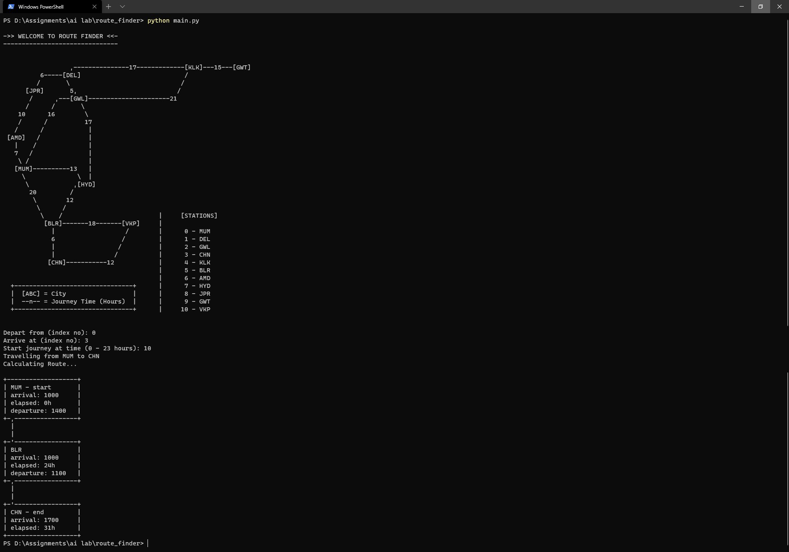

# Route Finder

Optimal Train Route Generator Using Modified A* Search

***

## The Problem

A standard node-to-node travel problem can easily be solved by means of a simple seacrh algorithm, like BFS, A* or Branch & Bound. Such a solution assumes that the agent can freely depart from any node at any time.

However for a system like a train network, departures occur on a scheduled basis. The agent may only leave a node at given times described by the schedule table. This means that the cumulative cost at each node is not just the sum of path costs, but also needs to consider the time an agent spends waiting at each node.

## The Solution

We can slightly modify the evaluation function `f(n) = h(n) + g(n)` in A* to include a third term `w(n)` which denotes the total waiting duration of the agent till that node. Practically this is implemented by adding only the previous wait time to the g(n) term at each step.